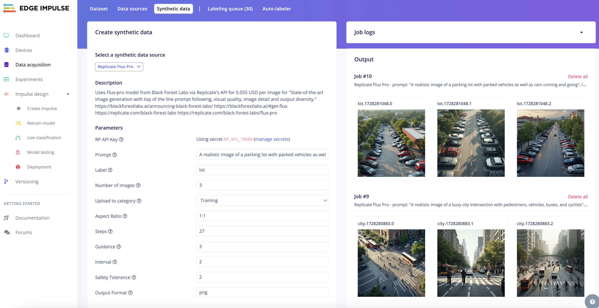
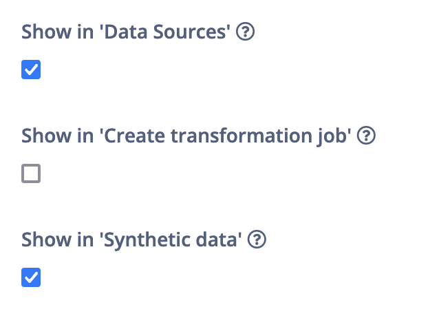

# Flux-pro Replicate.com Image Generation Block for Edge Impulse

This is a transformation block that uses [Flux-pro from Black Forest Labs](https://blackforestlabs.ai/announcing-black-forest-labs/) via [Replicate.com](https://replicate.com/black-forest-labs/flux-pro) to generate synthetic data for your Edge Impulse project.

## How to run (Edge Impulse)

### Using the Synthetic Data feature (professional & enterprise)

The Studio now has a feature for interacting with Synthetic Data directly from the Studio; and the Flux-pro block is available there.

1. Go to a Professional or Enterprise project, choose **Data acquisition > Synthetic data**.
2. Select the 'Flux-pro Synthetic Image Generator' block, fill in your prompt and label, and hit *Generate data*.

    > You currently need an API Token from Replicate, see https://replicate.com/account/api-tokens

3. Your synthetic data will show on the right side, for quick evaluation of your prompt.

### Customizing this repository (enterprise only)

You can modify this repository and push it as a new custom Synthetic Data transformation block.

1. Install the [Edge Impulse CLI](https://docs.edgeimpulse.com/docs/tools/edge-impulse-cli).
2. Open a command prompt or terminal, and navigate to this folder.
3. Create a new transformation block:

    ```
    $ edge-impulse-blocks init

    ? Choose a type of block: Transformation block
    ? Choose an option: Create a new block
    ? Enter the name of your block: Custom Flux-pro Image Generator
    ? Enter the description of your block: Use the Replicate API to generate new images from Flux-pro.
    ? What type of data does this block operate on? Standalone (runs the container, but no files / data items passed in)
    ? Which buckets do you want to mount into this block (will be mounted under /mnt/s3fs/BUCKET_NAME, you can change these mount points in the Studio)?
    ? Would you like to download and load the example repository? no
    ```



4. Push the block:

    ```
    $ edge-impulse-blocks push
    ```

5. To show this block in Synthetic Data:
    1. Go to your Edge Impulse organization.
    2. choose **Custom blocks > Transformation**, find your new block, click the three dots, and select *Edit transformation block*.
    3. Enable 'Show in Synthetic data':

        

    4. Save the block.

6. You can now access your modified block from **Data acquisition > Synthetic data** on any enterprise project.

## How to run (locally)

1. Install the dependencies:

    ```
    pip3 install -r requirements.txt
    ```

2. Run the generate script:

    ```
    RP_API_TOKEN=r8_... EI_PROJECT_API_KEY=ei_034... python3 transform.py --prompt "A photo of a factory worker wearing a hard hat" --label "hard_hat" --images 3
    ```

    > Replace `r8_...` with a valid [Replicate API Token](https://replicate.com/account/api-tokens), and replace `ei_034...` with your Edge Impulse API Key (**Dashboard > Keys**).

3. Output is stored both in `output/` and uploaded to your Edge Impulse project.

## --synthetic-data-job-id argument / x-synthetic-data-job-id header

If you want to build your own custom Synthetic Data block, you'll need to parse the (optional) `--synthetic-data-job-id` argument. When uploading data to the ingestion service you need to then pass the value from this argument to the `x-synthetic-data-job-id` header. [transform.py](transform.py) implements this. This is required so we know which job generated what data, and is used to render the UI on the Synthetic Data page.